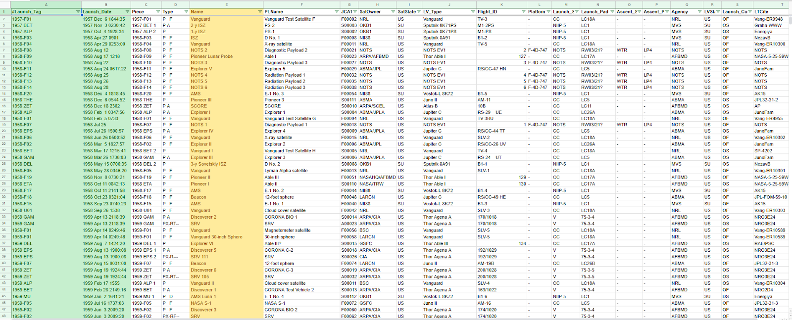
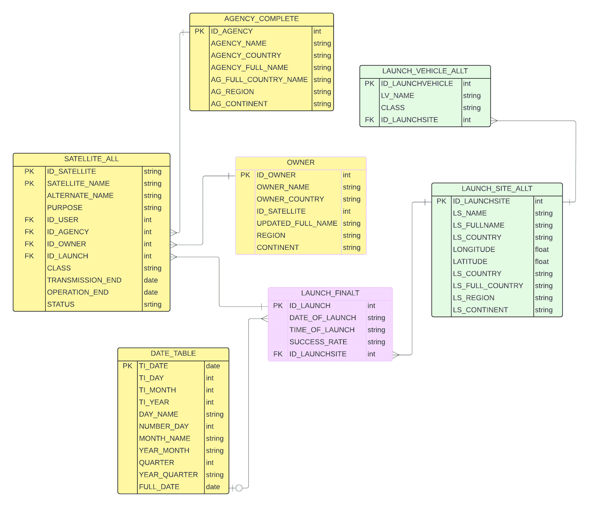
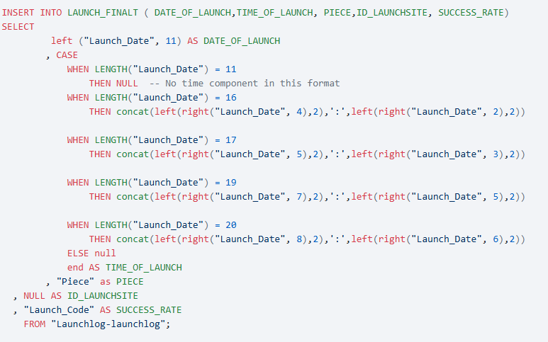

# Přehled vypuštěných satelitů od počátku dobývání vesmíru
**Mentees:** Anastasiia Mozharova, Anwar Pospíšil 

**Mentoři:** Petr Holík, Zuzana Katich 

Volba tématu
---
Na začátku jsme obě přišly s několika různými nápady z oblastí filmového průmyslu, gender equality nebo duševního zdraví, ale nebyl tam až takový překryv. Téma, které jsme nakonec vybraly, bylo zkrátka to jedno, na kterém jsme se shodly, že nás zajímá obě - vesmírný průzkum. 

**Anwar:** Vesmír je jedno z témat, které mě zajímalo od dětství, fascinovaly mě různé astronomické úkazy a přečetla o tom jsem v té době spoustu knih. Kromě toho jsem už přes deset let členem největšího českého Star Trek fanklubu. Takže když Nasťa navrhla něco o vesmírných misích, řekla jsem si, to zní dobře. 

**Anastasiia:** Narodila jsem se v Rusku, kde je vesmír velké téma. Máme dokonce i speciální svátek s názvem „Den kosmonautiky“ a už od první třídy jsme na něj tvořili plakáty a projekty. Těsně před začátkem akademie jsem dokoukala seriál “For All Mankind”, který mě opravdu oslovil a spustil takovou menší fixaci na vesmír. To mě inspirovalo k tomu, abych navrhla vesmírné téma pro náš projekt. 

Zdroj dat
---
Jako hlavní zdroj dat jsme použily stránku Jonathan´s Space Report. Jde v podstatě o bezplatný internetový zpravodaj založený v roce 1989, který poskytuje technické podrobnosti o startech družic. Jeho autor je Jonathan McDowell, astrofyzik a historik kosmonautiky z Harvardu. Provádí výzkum historie vesmírného průzkumu s využitím původních zdrojů a pravidelně na stránku doplňuje informace. Jeho databáze poskytuje nejobsáhlejší historický seznam informací o vypouštění družic počínaje Sputnikem. Na stránce jsou různorodé tabulky v různých formátech včetně popisů jednotlivých sloupců, což bylo neuvěřitelně užitečné. Jeho databáze je velmi rozsáhlá, takže chvíli trvalo se v ní aspoň rámcově zorientovat a rozhodnout se, které tabulky chceme použít pro náš projekt. Původně jsme zvažovaly i jiné zdroje, ale v těch bylo méně informací obecně nebo obsahovaly jen americké satelity, a nás zajímal spíše celosvětový přehled.

Na začátku jsme zvolily dvě výchozí tabulky, Launchlog ze stránky Jonathan´s Space Report a USC Satellite Database. Ve finální verzi našeho projektu zůstala nakonec jen ta první, kterou vidíte na obrázku, ale k tomu se ještě dostaneme. 

Průběh práce a co všechno se několikrát předělávalo
---
Potom jsme probraly, jaký typ informací nás zajímá a chtěly bychom s nimi pracovat, a podle toho vytvořily datový model. Samozřejmě, že se během práce několikrát stalo, že jsme zjistily, že něco nefunguje správně, něco má být atribut jiné entity a dokonce že jednu tabulku vůbec nepotřebujeme a naopak musíme vyrobit ještě jinou, novou. Naši mentoři nám také poradili vytvořit samostatnou tabulku s časovými údaji, aby bylo na konci projektu snazší filtrovat ve vizualizacích podle datumu. 

Každopádně, model, se kterým jsme nakonec byly spokojené, vypadá takhle: 

Pak následovala asi nejdelší a nejtěžší část, naplnit tabulky a vyčistit data. 

Začaly jsme tím, že jsme stáhly tabulky ve formátu tsv. a nahrály je do Google Sheets. Ve formě Excel tabulky už šlo nahrát datasety do Kebooly. Rozhodly jsme se také, že hlavním nástrojem pro náš projekt bude SQL.

Během prvního hackathonu jsme začaly pomocí Kebooly vyrábět a plnit jednotlivé tabulky. Po jejich dokončení podle našeho modelu jsme si bohužel všimly, že některé sloupce jsou plné jen z 27 %. To nás vedlo k přehodnocení našich původních dat. V této fázi jsme se rozhodly spolehnout čistě na Jonathan´s Space Report jako zdroj, protože jeho tabulky obsahovaly nejkomplexnější data. Informace, které nám v té chvíli k většině satelitů chyběly, jako například stát, kterému patří, nebo účel, k jakému jsou využívány, se nám podařilo po chvíli hledání získat z jiných částí jeho datasetu. Konkrétně šlo o tabulky Payload a Organization.

Další výzva, které jsme čelily, bylo nekonzistentní formátování některých dat v Jonathanových tabulkách. To se týkalo například sloupce s datem startu satelitu, kde jsme našly hodnoty od samotného roku po přesné datum a čas na setiny sekund. Úprava proběhla pomocí tohoto kódu: 

Jiná zajímavá zkušenost bylo, když nás mentoři provedli tvorbou tabulky s daty.

A tím to zdaleka neskončilo. Další úpravy vyžadovala nekonzistentnost dat u sloupců „TRANSMISSION_END“ a „OPERATION_END“. Někde byly měsíce zapsány slovy, takže jsme je museli oddělit a standardizovat. Pro data, která obsahovala pouze rok bez konkrétního měsíce a dne, jsme nastavili hodnotu na 1. ledna, abychom zachovali konzistenci. Kromě toho satelity, které jsou stále aktivní, měly v těchto sloupcích hvězdičku, což znamenalo, že nešlo převést jejich formát na datum. Pro řádky s hvězdičkou jsme tedy vytvořily nový sloupec s názvem STATUS a formátem string.

Během druhého hackathonu jsme se pustily do vizualizací. V této fázi jsme objevily další problém: ne všechny kódy zemí ve výchozí tabulce odpovídaly obvyklému dvoupísmennému formátu. Například Japonsko bylo uvedeno jako „J“ místo „JP“. Pro lepší čitelnost vizualizací jsme se také rozhodly přidat nový sloupec s plnými názvy zemí a sloupce pro obchodní regiony a kontinenty.

Naše výchozí tabulka neobsahovala sloupec s plnými názvy zemí, takže jsme je začaly dohledávat na internetu a ručně psát podmínky pomocí CASE WHEN pro každou zemi.

Naši mentoři nám ale navrhli chytřejší přístup: vytvořit dodatečné vstupní tabulky s těmito informacemi, což významně zkrátilo a zjednodušilo kód.
Abychom proces ještě více zefektivnily, použila Nasťa ChatGPT k vytvoření tabulek s plnými názvy všech zemí a jejich rozdělením do regionů a kontinentů.

Výstupy
---
Během naší analýzy jsme hledaly odpovědi na několik otázek. U některých jsme měly představu, jaká asi bude odpověď, a obvykle se potvrdila. 
Nejvíce vypuštěných satelitů mají nepřekvapivě USA (12 809) a nejméně státy Súdán, Bolívie, Laos, Jordánsko, Tunisko, Arménie, Senegal, Ghana, Litva, Kostarika, Džibuti, Srí Lanka, Moldávie, Rwanda, Uganda, Guatemala, Zimbabwe, Papua Nová Guinea a Paraguay, které mají každý po jednom satelitu. Navíc ne všechny z nich odstartovaly úspěšně. 

Nejúspěšnější agentura je v současnosti SpaceX. Tento graf zobrazuje top 5 agentur a procentuální rozložení toho, jaké různé typy satelitů zatím vyslaly. 

Vytvořily jsme mapu startovních ploch včetně počtu startů ke každé z nich. I k ní jsme přidaly filtr, aby bylo možné si prohlédnout postupný vývoj. 

Celosvětovou statistiku využití satelitů zobrazuje následující graf. Při proklikávání výsledků po jednotlivých zemích asi nikoho nepřekvapí, že v Severní Koreji využívá satelity hlavně armáda. 

Co by to bylo za projekt o vesmírném průzkumu, kdyby se tam neobjevilo nic o závodech mezi USA a Sovětským svazem. Zde vidíme vývoj toho, kolik objektů ročně během této části historie obě mocnosti vypustily.

.png)

Další otázka, která nás zajímala, byla, jak si vedou jednotlivé státy pokud jde o úspěšnost startů (tedy jestli ke startu vůbec dojde a jestli celé těleso nevybouchne). 

Nějaká konkrétní čísla a zajímavosti na závěr: 
---
Celkový počet vypuštěných satelitů podle našeho zdroje: 22 757

Z toho počet satelitů, které stále vysílají: 10 228

Českých a slovenských satelitů dohromady bylo vypuštěno celkem 17.  A navíc, na rozdíl od těch amerických, všechny odstartovaly úspěšně. :-D 8 jich stále funguje.

První vypuštěný satelit celosvětově: Sputnik 1, 4. října 1957. Odstartoval z ruského Bajkonuru, byla to zhruba osmdesátikilová koule s anténami a vysílačkou a o tři měsíce později shořel v atmosféře. 

Nejstarší stále funkční satelit: prý americký satelit pojmenovaný NNS 30020. Vypustila jej 13. prosince 1964 US Air Force Space Systems Division a využívá jej armáda, konkrétně námořnictvo, k navigaci. 

Ostatní grafy a dashboardy je možné si prohlédnout na tomto odkazu:

https://public.tableau.com/app/profile/anastasiia.mozharova/vizzes 

Odkaz na git hub:

https://github.com/jjnastya/DA_project

Odkaz na blog:

https://bit.ly/dadpp2024projekt14

Na čem kdo pracoval
---
**Anwar** 

Skoro na všem jsme pracovaly spolu, obvykle přes chat nebo videohovor na Discordu. Od výběru tématu, přes hledání vstupních dat, vytváření datového modelu a čištění po vizualizace a finální report. Práci jsme si rozdělily až ke konci, kdy jsem já napsala anotaci projektu a první verzi textu tohoto článku, zatímco Nasťa ještě dokončovala posledních několik úprav našich výstupních tabulek. Nakonec ještě doplnila do článku obrázky, svoje vyjádření k výběru tématu a rozdělení práce a několik dalších informací. Následně jsem celý text ještě jednou prošla já, abych zkontrolovala gramatiku a upravila věty do formy, která se bude lépe číst. 

**Anastasiia**

Jak Anwar řekla, většinu práce jsme dělaly společně, jen ke konci jsme bez většího přemýšlení začaly některé úkoly řešit samostatně. Já jsem se tedy pustila do práce s daty o konci přenosu a provozu, kde jsem je standardizovala. Dále jsem pracovala s kódy zemí, regiony a kontinenty a seskupila účely startů satelitů a také jsem doplnila jejich plné názvy.

Kromě toho jsem také pracovala na blogu a co se týče vizualizací, snažila jsem se do nich přidat úpravy a vylepšení.

A co jsme si z toho odnesly? 
---
**Anwar:** Do digitální akademie jsem se hlásila s tím, že chci novou sadu dovedností a kompletní změnu kariéry. Projekt byl skvělý způsob, jak si vyzkoušet práci datového analytika, procvičit používání nástrojů, se kterými jsme se během studia seznámily, a zjistit, jak budeme reagovat, pokud narazíme na problém. Byla to zajímavá zkušenost a určitě chci tímto směrem pokračovat. 

**Anastasiia:** Mým cílem pro akademii bylo naučit se nové hard skills, což si myslím, že se mi podařilo. Nejvíce mě bavila práce s SQL, Keboolou a Tableau, a v budoucnu bych se v těchto nástrojích chtěla ještě více zdokonalit. Tento projekt mi jasně ukázal, že práce datového analytika mě opravdu zajímá, a ráda bych v této specializaci pokračovala.
